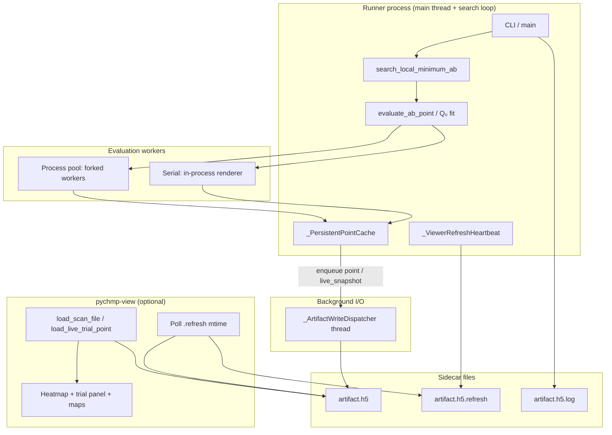
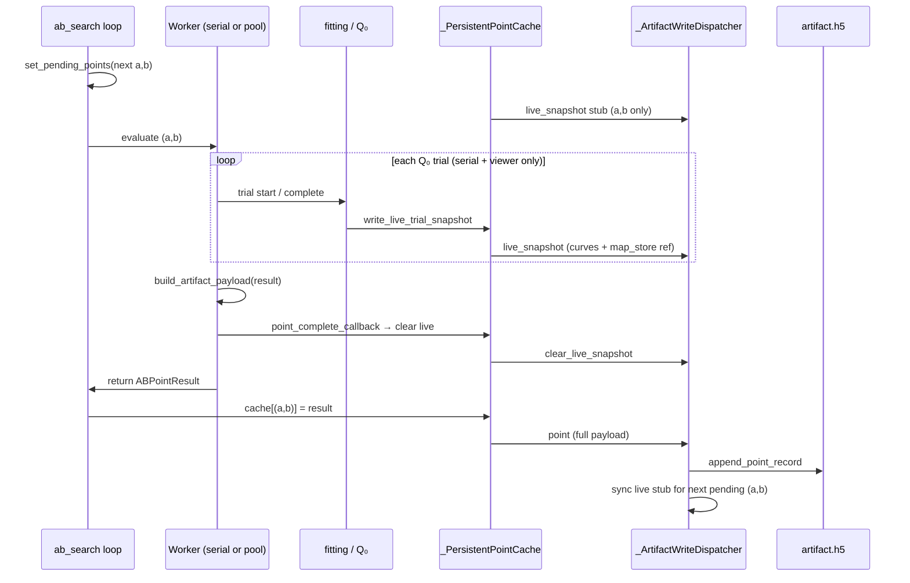
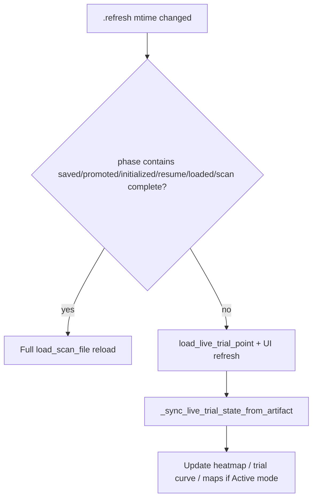

# pyCHMP Workflow Architecture

**Status:** As implemented (June 2026)  
**Audience:** Reviewers planning improvements to runner/viewer contracts, execution policies, and artifact I/O.

This document describes the **current** pyCHMP adaptive-search workflow end to end: how workers run, how artifacts are structured and written, and how `pychmp-view` interacts with live versus completed runs. For the long-term target schema, see [artifact_data_contract.rst](artifact_data_contract.rst). For the heartbeat refactor details, see [viewer_refresh_workflow.rst](viewer_refresh_workflow.rst).

---

## 1. Scope and entry points

### Primary workflows

| Workflow | Entry script | Role |
|----------|--------------|------|
| Adaptive local `(a,b)` search (single observation) | `examples/python/adaptive_ab_search_single_observation.py` | Main production path for MW/EUV single-slice fits with optional live viewer |
| Rectangular / sparse grid scan | `examples/scan_ab_obs_map.py` | Fixed or sparse `(a,b)` grids; shares search engine and artifact writer |
| Single-point Q₀ fit | `examples/fit_q0_obs_map.py` | One `(a,b)` cell; converging toward canonical artifact layout |
| Viewer | `examples/pychmp_view.py` | GUI for consolidated `.h5` artifacts |

### Core library modules

| Module | Responsibility |
|--------|----------------|
| `pychmp/ab_search.py` | Adaptive Phase 1/2 search, point scheduling, cache integration |
| `pychmp/ab_scan_execution.py` | Serial vs process-pool task execution |
| `pychmp/ab_scan_artifacts.py` | Unified H5 read/write, `map_store`, live trial groups |
| `pychmp/fitting.py` | Q₀ bracketing / bounded minimization per `(a,b)` |
| `pychmp/viewer.py` | Artifact loader, heatmap, trial curves, live refresh |
| `examples/python/adaptive_ab_search_single_observation.py` | Runner CLI, renderer factory, `_PersistentPointCache`, `_ArtifactWriteDispatcher`, heartbeat |

---

## 2. High-level architecture



**Design principle (post-2026-05 refactor):** the runner writes **truth into the artifact**; the heartbeat file is only a **wake-up signal** with routing hints (`phase`, `slice_key`, `search_id`). The viewer reads live curves and maps from the H5, not from duplicated state in `.refresh`.

**Warm start (map_store):** at each grid point start, the runner rescoring pass reads compatible `map_store` arrays, recomputes **χ², ρ², and η²** under the current mask/shift policy, and commits ordinary `grid_points/.../trials` rows with `map_refs.raw_modeled` pointing at the **existing** map path (no duplicate map datasets, no warm-only metadata). The viewer cannot distinguish those trials from gxrender-produced trials after refresh.

---

## 3. Adaptive search workflow

### Phase structure

`search_local_minimum_ab()` in `ab_search.py` runs:

1. **Phase 1** — expand a local `(a,b)` neighborhood from `(a_start, b_start)` using steps `da`, `db`.
2. **Phase 2** (optional) — threshold-region expansion unless `--no-area`.

Each **grid cell** `(a,b)` triggers one **point evaluation**:

1. Build renderer for `(a,b)` via `renderer_factory(a, b)`.
2. Run Q₀ search (`evaluate_ab_point`) — possibly multi-stage (`--q0-search-stages data,union`).
3. Build artifact payload from streamed renders (`build_artifact_payload`).
4. Persist to cache → artifact dispatcher.



### Resume / preload

On startup when the artifact already exists:

1. **Slice map index**: `build_slice_map_index(artifact, slice_key=...)` scans `map_store` identities, synthetic registry, and all grid trials on that slice once. The in-memory `(a,b) → q0 → map_ref` table is the fast lookup for warm start and render reuse (artifact remains canonical).
2. **Default resume** (no flags): `cache.hydrate_from_existing()` loads compatible completed `(a,b)` points from the active search; the adaptive walk skips those cells. `promote_*` plus the slice index register warm q0 curves without re-rendering stored maps.
3. **`--recompute-existing` or `--new-search-identity`**: hydration is skipped (fresh grid). Startup builds the slice map index only (no `promote_*` rescore sweep). **Warm rescoring and grid trial commits run at each grid point start** via `commit_map_store_warm_trials_for_point`.
4. **`--recompute-search-id SEARCH_ID`**: **repair** mode (not a full grid reset). Restores the stored scoring recipe from that search's `diagnostics_json` / `request_json`, rejects CLI flags that would override it, preserves valid map-linked trial rows without rescoring, resets only contract-broken points, and resumes the adaptive walk to complete incomplete cells. Requires `--artifact-h5`. Use `--recompute-existing` when you intend to wipe and refit the whole search grid.
5. **`--expand-grid-search-id SEARCH_ID`**: **expand** mode on the same search identity. Restores the stored scoring recipe, rejects all CLI overrides except widened `--a-min` / `--a-max` / `--b-min` / `--b-max` (strict superset of the stored footprint), preserves valid trials without rescoring, hydrates completed `(a,b)` cells, and runs the adaptive walk only for new/outstanding cells in the enlarged domain. The first Phase‑1 step anchors on the best grid point along the **prior** footprint wall facing the widened bound (not the original interior `(a_start, b_start)`), matching IDL’s “fill only new shell cells” intent.

### Map-store rescore sidecar (`pychmp-rescore`)

Standalone utility (no viewer): read-only on the main artifact’s `map_store`, write a sidecar H5 with a new search identity `{root}_r1`, `{root}_r2`, …, then commit into the main file when no search is active.

```bash
pychmp-rescore build --artifact-h5 MAIN.h5 --source-search-id search_260dfc2a336f2666
pychmp-rescore commit --artifact-h5 MAIN.h5 --sidecar MAIN.search_260dfc2a336f2666_r1.rescore.h5
```

Relaunch `pychmp-view` after commit to select the new identity.

### Render reuse during search

1. **Per-trial render**: `_TrackedRendererProxy.render_pair` returns maps from the in-memory stream or slice index before calling gxrender.
2. Heartbeat phase may be set to `"resume"` / `"loaded N compatible point(s)"` or warm-preload messaging for grid-reset modes.

Compatibility uses `compatibility_signature` in diagnostics plus effective content hashes (arrays win over stale metadata hashes).

### Planned: per-point repair utility

Cherry-picked refit of selected `grid_points` under an existing `search_id` (warm vs cold `map_store`) is **not** implemented. See handoff note `future-implementation-notes/pyCHMP/2026-06-01-pyCHMP-point-repair-utility-handoff.md`.

---

## 4. Serial vs parallel execution

### Policies

Configured via `--execution-policy` (`serial` | `process-pool` | `auto`). Resolved in `resolve_execution_plan()` (`ab_scan_execution.py`):

| Requested | Resolved when | Workers |
|-----------|---------------|---------|
| `serial` | Always | 1, in-process |
| `process-pool` | Always | `min(task_count, cpus, --max-workers)` |
| `auto` | `task_count < 4` or 1 CPU | serial |
| `auto` | otherwise | process-pool with conservative worker count |

Parallel evaluation uses `ProcessPoolExecutor` with a bootstrapped worker state (renderer factory payload pickled to child processes).

### Behavioral differences (important)

| Feature | Serial | Process pool |
|---------|--------|--------------|
| Per-trial progress callbacks | Yes | **No** (raises if progress_callback set with non-serial) |
| `point_start_callback` / `point_complete_callback` | Yes | **No** |
| Live `live_trial_point` streaming during Q₀ | Yes (with viewer) | **No** |
| `set_pending_points` before each point | One `(a,b)` at a time | Batch of all pending neighbors |
| Console trial numbering | Per-point Q₀ trials | Per completed point only |
| Artifact point writes | Same (`append_point_record`) | Same |

**Implication:** live viewer updates during Q₀ bracketing require **`--execution-policy serial`** (default in adaptive script). Process-pool mode still appends completed points to the artifact but does not stream incremental trial state.

### Search thread vs dispatcher thread

Even in serial mode:

- **Search / render / fit** run on the main thread (or pool workers for parallel points).
- **All H5 writes** go through `_ArtifactWriteDispatcher` on a **daemon background thread** with a bounded queue (max 16). The search continues while writes are pending; `cache.flush_pending_writes()` drains the queue at critical points (e.g. after each live trial update when viewer is enabled).

---

## 5. Artifact structure (unified layout)

Contract version: `2026-05-28-slice-shared-canvas` (`CANONICAL_ARTIFACT_CONTRACT_VERSION`).

### Top-level layout

```
artifact.h5
├── map_store/
│   ├── maps/<sha256>/
│   │   ├── data                    # float32 2D array
│   │   └── identity_json           # content-addressed identity
│   └── synthetic_registry/         # optional EUV/MW auxiliary map registry
└── slices/
    └── <slice_key>/                # e.g. mw_2p873584ghz, euv_171
        ├── common/
        │   ├── observed, sigma_map, psf_kernel, wcs metadata
        │   ├── diagnostics_json, slice_descriptors_json, ...
        │   └── observation_ref/    # rotated/regridded obs reference (when used)
        ├── active_search_id        # dataset: current search id string
        └── searches/
            └── <search_id>/
                ├── attrs: status, in_progress, active, *_point_count, target_metric
                ├── diagnostics_json, request_json, lifecycle_json, layout_json
                ├── point_records/
                │   └── r000012/      # one group per saved (a,b) point
                └── live_trial_point/ # transient; present only during in-flight work
```

Legacy layouts (root-level `point_records`, rectangular `summary` grids) remain **readable** via `load_scan_file()` but new adaptive runs write the **search-scoped** layout above.

### Search identity

- `search_id` is derived from evaluation config (`search_id_from_evaluation_config`) — mask, metric, bounds, geometry signature, etc.
- Multiple searches can coexist on one slice (e.g. different metrics or recomputes).
- `lifecycle_json` tracks `created_at`, `started_at`, `completed_at`, `active`, `in_progress`.

### Point record (`point_records/rNNNNNN/`)

Written by `_write_point_group()` when a point completes:

**Scalar metadata (attrs + datasets):**

- Coordinates: `a`, `b`, `q0`, `status`, `success`, `target_metric`
- Q₀ history: `fit_q0_trials`, `fit_metric_trials`, `fit_chi2/rho2/eta2_trials`
- Shifts (when logged): `fit_shift_x/y_trials`, `fit_find_shift_valid_trials`, `fit_trial_mask_stages`
- Optimizer: `nfev`, `nit`, `bracket`, `used_adaptive_bracketing`, …

**JSON datasets:**

- `trial_history_json` — per-trial q₀, metrics, `raw_map_ref`
- `map_refs_json` — logical name → `/map_store/maps/...` path
- `diagnostics_json` — provenance, compatibility signature, timing

**Maps:** stored in **`/map_store`**, referenced by hash. Typical keys:

- `trial_raw_modeled_maps/000`, `001`, … — one ref per Q₀ trial
- `raw_modeled_best`, `modeled_best`, `residual` (when written)
- EUV/MW auxiliary entries under `extra/...` or synthetic registry

### Live group (`live_trial_point/`)

Ephemeral. Recreated on **every** live update (delete group + create group).

| Field | Role |
|-------|------|
| attrs `a`, `b`, `q0`, `trial_index` | Active grid cell and trial |
| `fit_q0_trials`, `fit_metric_trials` | Curves for completed trials in current point |
| `trial_history_json` | Per-trial refs; `raw_map_ref` filled as trials complete |
| `updated_utc`, `metric_name`, `slice_key`, `search_id` | Bookkeeping |

Maps for completed **live** trials go to `map_store` with identity name `live_trial_raw_modeled_maps/NNN`. When the grid point is saved, full trial maps are written again under `trial_raw_modeled_maps/NNN` in the point record (live refs may remain orphaned in `map_store`).

### Sidecar files

| File | Writer | Purpose |
|------|--------|---------|
| `<artifact>.h5.refresh` | `_ViewerRefreshHeartbeat` | JSON: `{phase, slice_key, search_id}` |
| `<artifact>.h5.log` | Runner stdout tee | Run header with `pid=...`; viewer uses last PID for liveness |
| `<artifact>_grid.png`, `_point.png` | Runner (post-search) | Quick-look PNGs |

---

## 6. Artifact write dispatcher

Class: `_ArtifactWriteDispatcher` in `adaptive_ab_search_single_observation.py`.

### Queue operations

| Operation | Trigger | H5 effect |
|-----------|---------|-----------|
| `point` | `cache[(a,b)] = result` | `append_point_record` → new `point_records/r…` + lifecycle counts |
| `live_snapshot` | Q₀ progress or `set_pending_points` | `write_live_trial_point` |
| `clear_live_snapshot` | Point start/complete, pending cleared | `clear_live_trial_point` |

After each **`point`** write (when viewer enabled):

1. Remove `(a,b)` from heartbeat pending list.
2. `_sync_active_live_snapshot_from_pending()` — write stub for next queued `(a,b)` or clear live.
3. Heartbeat phase `"point saved"` + touch `.refresh`.

### Lock tolerance

H5 opens use retry with backoff. Errors matching read-only lock contention (viewer holding file open) are **skipped with warning** for live snapshot ops; point writes retry up to 12 attempts.

### What is **not** written by the current adaptive runner

- `active_point_snapshot` — defined in schema and used as viewer fallback, but **never populated** by the adaptive runner.
- Pending-point queue — kept in runner memory for heartbeat phase strings only; **not** in H5.

---

## 7. Live runner ↔ viewer contract

### Runner liveness (viewer detection)

`_live_runner_detected()` is true if **any** of:

1. Last `pid=` from `.log` refers to a running process, or  
2. `.refresh` mtime is within grace window (`_ACTIVE_REFRESH_GRACE_S`) **and** the search is not terminal, or  
3. The selected search is not terminal (no fresh refresh and no live pid).

### Heartbeat → viewer action

Viewer polls `.refresh` every `_EXTERNAL_REFRESH_POLL_MS`.



Phase substring matching is implemented in `_heartbeat_requires_payload_reload()`.

### Viewer navigation modes

| Mode | Behavior when live | Behavior when inactive |
|------|--------------------|-------------------------|
| **Free** | User picks slice, search, `(a,b)` | Same |
| **Active** | Follow runner cell; locks grid selection | Disabled unless live runner + live state |
| **Best** | Jump to best metric on grid | Available if grid has computed points |

`pychmp_view.py` auto-selects the active slice/search and Active navigation when a live runner or in-progress search is present on the opened artifact.

### Display pipeline for maps

For a selected trial index:

1. **Saved point:** `load_selected_trial_plot_payload()` → `trial_history_json` / `map_refs_json` → `map_store` → PSF convolve with `common/psf_kernel`.
2. **Live point:** `load_live_trial_plot_payload()` if `(a,b)` matches `live_trial_point` attrs.

Observed map always from slice `common/` (or observation reference extraction).

### Inactive / completed artifact

When no live runner is detected:

- `live_trial_point/` is usually **absent** (cleared after each point).
- Viewer loads **`point_records` only** via full `load_scan_file()`.
- If `lifecycle.active` is still true but runner is dead → **stale active search** notice; defaults to Free navigation (`_stale_active_search()`).
- User can browse all saved searches on the slice, compare metrics on heatmap, open Selected Solution window for any saved point.

### Known friction points (current implementation)

These are intentional documentation of gaps for review — not bugs per se:

1. **Dual writers to `live_trial_point`:** Q₀ progress callbacks (rich) vs `set_pending_points` / post-save sync (minimal stub) can overwrite each other.
2. **Maps lag curves:** trial metric curve updates before `raw_map_ref` exists for that trial index.
3. **No live shift arrays:** FindShift results appear in saved `point_records` but not in live group.
4. **`active_point_snapshot` unused** by runner despite viewer fallback path.
5. **HDF5 single-writer vs read-only viewer:** viewer opens artifact read-only; concurrent R+ writes can contend (mitigated by skip/retry, not SWMR).
6. **Parallel mode:** no live trial streaming; viewer only sees updates on point save phases.

---

## 8. End-to-end timeline: one `(a,b)` with live viewer (serial)

| Step | Process | Disk |
|------|---------|------|
| 1 | Search queues next cell | `live_trial_point`: `{a,b}`, empty trials |
| 2 | Point start callback | delete `live_trial_point` |
| 3 | Trial 0 starts | `live_trial_point`: trial_index=0, q0=… |
| 4 | Trial 0 completes | curves + `map_store` ref for trial 0 |
| 5 | … more trials … | incremental updates |
| 6 | Point completes | clear `live_trial_point` |
| 7 | Cache saves point | `point_records/r…` + all trial maps in `map_store` |
| 8 | Dispatcher sync | stub `live_trial_point` for next `(a,b)` if any |
| 9 | Heartbeat | `.refresh` phase `"point saved"` |

---

## 9. Related documents and files

| Document | Topic |
|----------|-------|
| [artifact_data_contract.rst](artifact_data_contract.rst) | Target canonical schema and migration phases |
| [viewer_refresh_workflow.rst](viewer_refresh_workflow.rst) | Heartbeat refactor checklist |
| [geometry_policy.rst](geometry_policy.rst) | Observer / FOV alignment |
| [provenance.rst](provenance.rst) | Model/obs/EBTEL provenance fields |

| Code | Topic |
|------|-------|
| `src/pychmp/ab_scan_artifacts.py` | `write_live_trial_point`, `append_point_record`, `load_scan_file` |
| `examples/python/adaptive_ab_search_single_observation.py` | Dispatcher, cache, heartbeat |
| `src/pychmp/viewer.py` | Poll, reload, live sync, navigation modes |
| `tests/test_viewer_scan_state.py` | Viewer contract tests |
| `tests/test_adaptive_single_observation_cli.py` | Runner / heartbeat tests |

---

## 10. Generating PDF

From the `pyCHMP` directory (requires [Pandoc](https://pandoc.org/)):

```bash
pandoc docs/workflow_architecture.md -o docs/workflow_architecture.pdf \
  --toc -V geometry:margin=1in
```

The Markdown source remains the canonical review document; PDF is optional for offline sharing.
