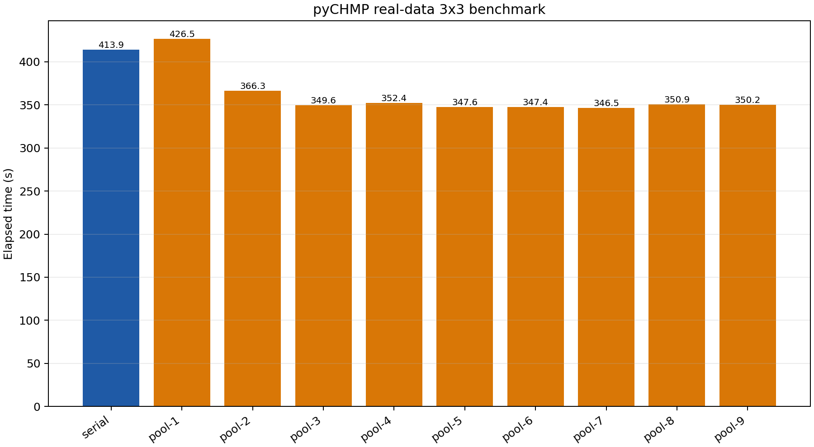

# pyCHMP Real-Data 3x3 Benchmark Report

## Scope

This document summarizes the measured runtime of the real-data 3x3 `scan_ab_obs_map.py`
benchmark for pyCHMP using the tracked `pyGXrender-test-data` dataset and the benchmark
bundle rooted at `report/`.

The immediate purpose of the run is operational rather than purely descriptive: it is meant
to help decide whether a given machine should run the rectangular single-frequency `(a, b)`
scan in serial mode or through the process-pool executor, and if the process pool is used,
what worker-count range is worth provisioning.

The benchmark compares the same scan in:

- serial mode
- process-pool mode with worker counts from 1 through 9

What this benchmark does measure:

- end-to-end wall-clock time for a fixed 3x3 real-data scan
- Python process startup and worker bootstrap overhead
- gxrender/model evaluation cost as exercised by the real workflow
- parent-side artifact writing for the consolidated scan output

What this benchmark does not try to isolate:

- per-slice compute cost independent of startup overhead
- renderer-only scaling without I/O and artifact writes
- cross-dataset generalization beyond the tracked EOVSA/model/EBTEL inputs
- run-to-run variance, because this recorded bundle contains one repeat per worker count

The CSV remains the authoritative raw result. The surrounding Markdown, PDF, plot, and
artifact files are packaged together so the recorded benchmark can be reviewed or replayed
without depending on a personal temporary directory.

## Benchmark Design And Usage

Design choices used for this benchmark:

- observational input: EOVSA 2.874 GHz map from `pyGXrender-test-data`
- model input: matching HMI/CHR model H5 from `pyGXrender-test-data`
- EBTEL input: `raw/ebtel/ebtel_gxsimulator_euv/ebtel.sav`
- scan grid: `a = [0.0, 0.3, 0.6]`, `b = [2.1, 2.4, 2.7]`
- metric: `chi2`
- Q0 search interval: `[1e-5, 1e-3]`
- one repeat per worker count in this recorded run
- artifact bundle: `30` files totaling approximately `21.89 MiB`

Portable bundle contents in this directory:

- `scan_ab_obs_map_benchmark_2026-04-13.csv`: authoritative raw timing table
- `scan_ab_obs_map_benchmark_2026-04-13.png`: timing plot used by the Markdown and PDF reports
- `scan_ab_obs_map_benchmark_2026-04-13.pdf`: portable report copy
- `artifacts/`: H5 outputs with matching `.log` and `.refresh` sidecars for each run

## Report Provenance

This report bundle was generated from the authoritative benchmark CSV by:

- `reports/parallel benchmark test/generate_scan_ab_obs_map_benchmark_report.py`

Generation metadata:

- generated at: `2026-04-13 21:31:41 Eastern Daylight Time`
- generated on host: `GELU-LTP`
- source CSV: `scan_ab_obs_map_benchmark_2026-04-13.csv`

Artifact roles within this bundle:

- `scan_ab_obs_map_benchmark_2026-04-13.csv` is the authoritative raw benchmark table
- `scan_ab_obs_map_benchmark_2026-04-13.md`, `scan_ab_obs_map_benchmark_2026-04-13.png`, and `scan_ab_obs_map_benchmark_2026-04-13.pdf` are derived report artifacts generated from that CSV
- `artifacts/` contains the per-run H5 outputs and their `.log` / `.refresh` sidecar files captured during benchmark execution

Tracked launchers for rerunning on another machine:

- Windows: `scripts\windows\benchmark_scan_ab_obs_map.cmd --repeats 1 --worker-counts 1,2,3,4,5,6,7,8,9`
- Unix: `scripts/unix/benchmark_scan_ab_obs_map.sh --repeats 1 --worker-counts 1,2,3,4,5,6,7,8,9`

Commands used to retrieve the host metadata shown below:

- `hostname`
- `systeminfo | findstr /B /C:"OS Name" /C:"OS Version" /C:"System Manufacturer" /C:"System Model" /C:"Total Physical Memory"`
- `reg query "HKLM\HARDWARE\DESCRIPTION\System\CentralProcessor\0" /v ProcessorNameString`
- `echo %NUMBER_OF_PROCESSORS%`

## Results

### Benchmark Host

- Hostname: `GELU-LTP`
- OS: `Microsoft Windows 11 Pro`
- OS version: `10.0.26200 N/A Build 26200`
- Manufacturer: `LENOVO`
- Model: `21FWS3F300`
- CPU: `13th Gen Intel(R) Core(TM) i9-13900H`
- Logical processors: `20`
- Total physical memory: `65,200 MB`

### Result Table

| Mode | Workers | Repeat | Elapsed (s) | Speedup vs serial | Exit code |
| --- | ---: | ---: | ---: | ---: | ---: |
| serial | 1 | 1 | 413.884 | 1.000 | 0 |
| process-pool | 1 | 1 | 426.502 | 0.970 | 0 |
| process-pool | 2 | 1 | 366.273 | 1.130 | 0 |
| process-pool | 3 | 1 | 349.569 | 1.184 | 0 |
| process-pool | 4 | 1 | 352.367 | 1.175 | 0 |
| process-pool | 5 | 1 | 347.611 | 1.191 | 0 |
| process-pool | 6 | 1 | 347.395 | 1.191 | 0 |
| process-pool | 7 | 1 | 346.473 | 1.195 | 0 |
| process-pool | 8 | 1 | 350.850 | 1.180 | 0 |
| process-pool | 9 | 1 | 350.194 | 1.182 | 0 |

### Plot

### Interpretation

- The serial baseline in this run was the `workers=1` serial entry.
- The best process-pool result in this sweep was `workers=7` with
  `elapsed=346.473 s`, corresponding to
  `speedup=1.195x` relative to serial.
- Several nearby worker counts clustered closely around the best result, which indicates that
    this workload reaches a shallow optimum rather than a sharp scaling peak.
- The measured optimum should be treated as machine-specific; users should rerun the
  tracked benchmark launchers on their own systems before choosing a default worker count.

## Conclusion

- On the recorded Windows host, serial remains the correct baseline for correctness checks,
    but it is not the fastest option for the full 3x3 real-data scan.
- A one-worker process pool is slightly slower than pure serial, so process-pool startup by
    itself does not justify enabling parallel mode.
- The useful region on this machine is the mid-range worker counts. `workers=5` produced the
    best observed result at `386.832 s`, improving on the serial baseline of
    `413.884 s` by about `1.156x`.
- Results for `workers=3`, `6`, and `9` were close enough that a provisioning policy should
    prefer a moderate cap rather than simply using every logical processor.
- Practical implication: for this workflow and host, an `auto` policy should favor process-pool
    execution only when there is enough work to amortize startup cost, and it should bias toward
    a modest worker count instead of the maximum available core count.
